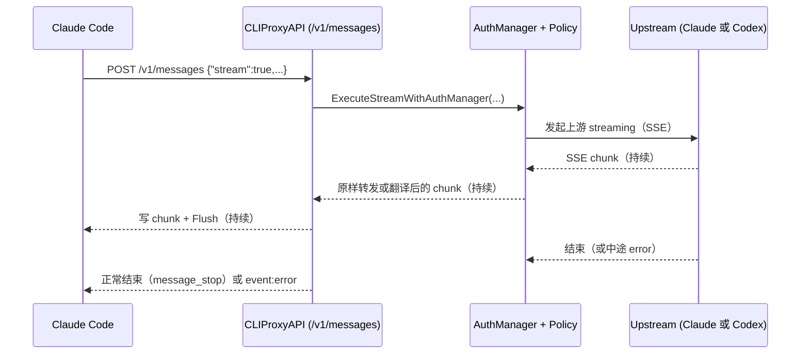
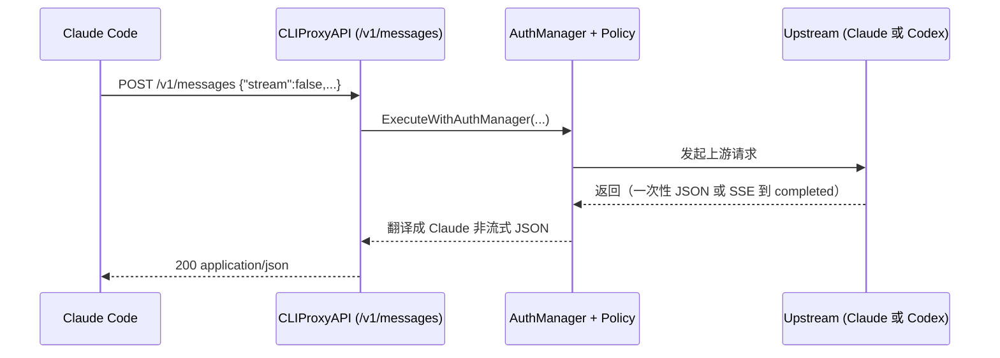

# Claude Code ↔ CLIProxyAPI ↔ 上游：流式/非流式与 SSE 全链路说明

本文目标：让你能从“Claude Code 客户端发起一次请求”开始，完整理解它如何经过 CLIProxyAPI 代理、路由/降级（failover）、再到上游 API（Anthropic 或 Codex/Responses），以及为什么会出现“卡住/408 断流”等现象。

---

## 0. 三个容易混淆的概念

1) **客户端是否流式（对 Claude Code 的体验）**
- **流式**：Claude Code 收到 `text/event-stream`（SSE），边到边显示（打字机效果）。
- **非流式**：Claude Code 收到一次性 `application/json`，等服务端生成完再返回。

2) **上游是否流式（CLIProxyAPI 到上游的连接形态）**
- 即使客户端是“非流式”，CLIProxyAPI 也可能为了稳定性/统一翻译逻辑，对上游使用 SSE，然后在服务端“攒到完成”再一次性返回 JSON。

3) **Go 里读取 response body 的方式**
- `io.ReadAll(body)`：一直读到 **EOF/连接关闭** 才返回。
- `bufio.Scanner(body)`：边读边处理（通常按行），可以在满足条件时 **提前返回**。

> 注意：`io.ReadAll` vs `Scanner` 只是“读同一条 HTTP body 字节流”的不同方式，**不会把非流式请求变成流式请求**。

---

## 1. SSE 是什么？为什么看起来像“长连接”

SSE（Server-Sent Events）是一种服务端单向推送的 HTTP 响应格式：

- 响应头通常是：`Content-Type: text/event-stream`
- 响应体由一系列事件组成，常见形态：
  - `event: ...`
  - `data: ...`
  - 空行分隔事件
- 连接会保持一段时间，直到服务端发完并关闭，或中途断开。

Anthropic Messages API 的 streaming 就是 SSE：请求体里 `stream:true` 时，上游会持续返回 `message_start / content_block_delta / message_stop` 等事件流。

参考：Anthropic 官方 “Streaming Messages (SSE)” 文档（Messages API）。  
https://platform.claude.com/docs/en/build-with-claude/streaming

---

## 2. Claude Code 一般是不是“流式”？

结论（从“你这个代理视角”）：**绝大多数交互式 Claude Code 会话会走流式 SSE**，但也存在非流式调用。

理由与证据：
- Claude Code 的 Agent/SDK 文档中将“Streaming Input Mode”标注为 **Default & Recommended**（长生命周期交互 session 的推荐模式）。  
  https://code.claude.com/docs/en/sdk/streaming-vs-single-mode
- Claude Code 本身提供与 streaming 相关的 CLI 选项（例如 `--output-format stream-json`、`--include-partial-messages`），说明其内部支持 SSE/流式事件处理链路。  
  https://code.claude.com/docs/en/cli-reference
- Claude Code 官方仓库里也有大量与 “API streaming stalls / hangs” 相关的 issue，表明客户端常态依赖 streaming 链路。  
  例如：https://github.com/anthropics/claude-code/issues/25979

常见非流式场景（经验总结，具体以抓包为准）：
- 生成很短的元信息/标题/摘要（一些实现会选择非流式）。
- `count_tokens`、`models` 这类接口本身就是一次性 JSON。
- headless/print 模式默认可能只在结束后打印（但底层仍可能用 streaming “兜底”，取决于实现与参数）。

---

## 3. Claude Code → CLIProxyAPI：我们怎么决定流式/非流式？

在 CLIProxyAPI 的 Claude handler（`POST /v1/messages`）里，逻辑是：
- 请求体 `stream:true` ⇒ 走服务端 streaming 转发（SSE）
- `stream:false` 或缺省 ⇒ 走非流式（一次性 JSON）

入口代码：
- `sdk/api/handlers/claude/code_handlers.go`：读取 `stream` 字段并分流

---

## 4. 端到端生命周期（两条主路径）

下面用两条主路径把“客户端→代理→上游”的完整生命周期串起来。

### A) 客户端流式：`POST /v1/messages` + `stream:true`

关键点：
- CLIProxyAPI 会先“窥探（peek）第一段数据”，确认上游没立即失败，再把响应头切换为 SSE（避免把本该是 4xx/5xx 的错误变成 200 SSE）。实现见 `sdk/api/handlers/claude/code_handlers.go` 的 streaming 分支。
- 如果上游走 Anthropic（ClaudeExecutor），我们会读取/转发 Anthropic 的 SSE；若请求来自 Claude 格式且目标也是 Claude，很多情况下可以原样转发（仅做必要的 OAuth tool prefix 处理）。
- 如果上游走 Codex（failover 到 GPT），我们会把 Codex 的 `response.*` SSE 事件翻译成 Claude Code 需要的 `message_* / content_block_*` SSE 事件。

### B) 客户端非流式：`POST /v1/messages` + `stream:false`（或缺省）

关键点（与 6d765e3/408 最相关）：
- 对于 **Codex 上游**，CLIProxyAPI 的 CodexExecutor 非流式路径仍会对上游 `/responses` 设置 `stream:true`，然后在服务端等 `response.completed` 到来后再一次性返回 JSON（这属于“上游流式/客户端非流式”的常见桥接方式）。
- 这就是为什么：即使 Claude Code 客户端是非流式，CLIProxyAPI 依然可能在内部处理 SSE。

---

## 5. “假卡住”与 `6d765e3`：为什么要从 `io.ReadAll` 改成逐行扫 SSE？

在 Codex 非流式路径里，上游返回的是 SSE。很多 SSE 实现会在发出 `response.completed` 后依然保持连接（keep-alive / 网关策略 / 缓冲等），导致：

- **旧逻辑（`io.ReadAll`）**：必须等上游 **关闭连接** 才返回 ⇒ 看起来像“卡住”（其实结果已经完成）。
- **新逻辑（逐行扫 `Scanner`）**：一看到 `data: {... type:"response.completed" ...}` 就立刻返回 ⇒ 不再等连接关闭。

这类改动属于“成功路径的提前退出”，不会制造 408；408 的根因是“在收到 completed 前连接就断了”。

---

## 6. 408（`stream disconnected before completion`）通常意味着什么？

当 CLIProxyAPI 在等上游 SSE 的终止事件（例如 Codex 的 `response.completed`）时，如果连接在终止事件前就断开，服务端无法拼出完整响应，只能报：

- `408 stream error: stream disconnected before completion: stream closed before response.completed`

这不等价于“你本机网络一定有问题”。常见原因包括：
- 上游/中间网关/代理主动断流或超时。
- 上游异常导致断开，但没有按预期发出完成/失败事件。
- 连接很久没有数据（idle）被中间层回收。

---

## 7. `/responses/compact` 兜底：为什么能显著降低 408？

`/responses/compact`（Codex/Responses 的一次性 JSON 形式）相比 SSE 更不容易因为“断流导致拿不到终止事件”而失败。

因此在 Codex 非流式执行中可以做一个“向前修复”的兜底策略：
- 如果 `/responses` SSE 在没等到 `response.completed` 就结束（或 scan 出错），自动再请求一次 `/responses/compact`；
- 只要 compact 成功，就把它包装成 `{"type":"response.completed","response":...}` 交给现有翻译器，最终仍返回成功结果给 Claude Code；
- 只有当 compact 也失败，才把 408/上游错误透传给客户端。

这类策略的代价：
- 断流时会多一次上游请求，可能增加 token 成本与延迟。

---

## 8. 排障建议：如何精准判断 408 的上游形态？

建议临时开启 `request-log`，抓一条 408 的上游响应尾部几行：
- 如果上游其实发了 `response.failed` / `error`，但我们没识别/没翻译，就应该增强事件识别；
- 如果是纯断流（EOF），那 `/responses/compact` 兜底更有效。

（CLIProxyAPI 的 request/response 聚合日志会记录每次“Attempt”的 URL、headers、以及 body 片段。）

